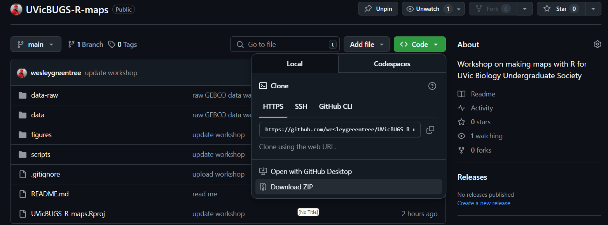

# Spatial analysis with R: applications in ecology and evolution

Workshop for UVic Biology Undergraduate Society (BUGS)

Victoria, BC

March 26, 2026

Wesley Greentree, wgreentree@outlook.com

Thank you for attending this workshop on using the R programming language to make beautiful maps to communicate science! This workshop covers a range of maps, from standard study area maps to animated maps with satellite images ([examples here](https://wesleygreentree.github.io/animations/)) This Github repository includes code, data, and slides for the workshop.

This workshop includes code for both the 2025 and 2026 workshops for BUGS. The major change for 2026 is the addition of `scripts/example-salmon-pathogens.R`, which includes an example of a spatial analysis.

**Before the workshop**

Please download this Github repository. If you are new to GitHub,
click the green code button, and select "Download ZIP".

Unzip the folder and move it to a desired location on your computer.

**Please run [scripts/00-packages.R](https://github.com/wesleygreentree/UVicBUGS-R-maps/blob/main/scripts/00-packages.R) before the workshop.** This scripts installs the necessary R packages for the workshop. 
If you haven't run an R script before, you can highlight all code in this script and select Code > Run Selected Line(s) in RStudio.

**Technical details**

Using R 4.5.3 with packages installed March 2026. 